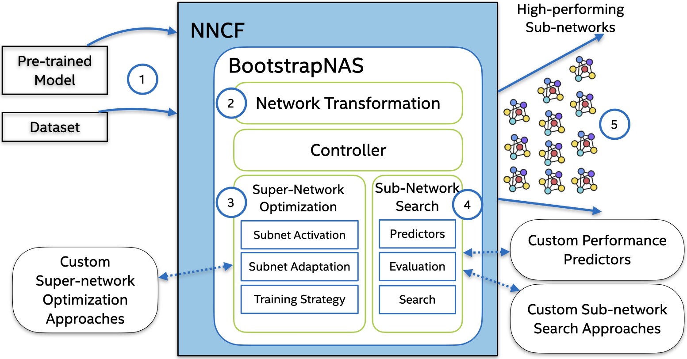

# BootstrapNAS Jupyter Notebooks

---

<p align="center">

</p>

BootstrapNAS (1) takes a pre-trained model as input. (2) It uses this model to generate a weight-sharing super-network. (3) BootstrapNAS then applies a training strategy, and once the super-network has been trained, (4) it searches for efficient subnetworks that satisfy the user's requirements. (5) The configuration of the discovered sub-network(s) is returned to the user.

## Quickstart 

Please follow the instructions [here](https://github.com/jpablomch/bootstrapnas/wiki/Quickstart).

If you already have a super-network trained with BootstrapNAS, please follow the instructions to search for sub-networks [here](https://github.com/jpablomch/bootstrapnas/wiki/Subnetwork_Search).

More information about BootstrapNAS is available in our papers:

[Automated Super-Network Generation for Scalable Neural Architecture Search](https://openreview.net/pdf?id=HK-zmbTB8gq).

```bibtex
  @inproceedings{
    munoz2022automated,
    title={Automated Super-Network Generation for Scalable Neural Architecture Search},
    author={Muñoz, J. Pablo and Lyalyushkin, Nikolay and Lacewell, Chaunte and Senina, Anastasia and Cummings, Daniel and Sarah, Anthony  and Kozlov, Alexander and Jain, Nilesh},
    booktitle={First Conference on Automated Machine Learning (Main Track)},
    year={2022},
    url={https://openreview.net/pdf?id=HK-zmbTB8gq}
  }
```
[Enabling NAS with Automated Super-Network Generation](https://arxiv.org/abs/2112.10878)

```BibTex
@article{
  bootstrapNAS,
  author    = {Muñoz, J. Pablo  and Lyalyushkin, Nikolay  and Akhauri, Yash and Senina, Anastasia and Kozlov, Alexander  and Jain, Nilesh},
  title     = {Enabling NAS with Automated Super-Network Generation},
  journal   = {1st International Workshop on Practical
Deep Learning in the Wild at AAAI},
  year      = {2022},
  url       = {https://practical-dl.github.io/2022/short_paper/21.pdf},
}
```

## Contributing to BootstrapNAS
Please follow the contribution guidelines in [NNCF](https://github.com/openvinotoolkit/nncf). 

