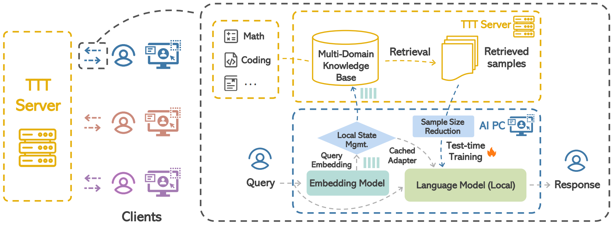

# CT3: Boosting Downstream Performance through Test-time Training

Official implementation of [CT3: Boosting Downstream Performance through Test-time Training]().

This repository contains the code for CT3, which is an advanced framework designed to enhance the performance of downstream tasks through Test-Time Training (TTT).



## Setup

Use the following instructions to create a virtual environment with the required dependencies.

```bash
# install dependencies
bash install.sh

```

<details>
<summary>Text-to-LoRA installation (optional)</summary>

```bash
git clone https://github.com/SakanaAI/text-to-lora.git
cd text-to-lora
pip install .
```

</details>

## Datasets

### Knowledge Base

The following datasets are utilized for CT3 knowledge base:

| Dataset            | Domain                | Link                                                                 |
| ------------------ | --------------------- | -------------------------------------------------------------------- |
| CoQA Training set  | Reading comprehension | [link](https://huggingface.co/datasets/EleutherAI/coqa)               |
| MetaMath  | Math | [link](https://huggingface.co/datasets/meta-math/MetaMathQA)               |
| Orca-Math  | Math | [link](https://huggingface.co/datasets/microsoft/orca-math-word-problems-200k)               |
| Math 50K           | Math                  | [link](https://github.com/AGI-Edgerunners/LLM-Adapters/blob/main/ft-training_set/math_50k.json) |
| The Stack Python (Random 600k)  | Coding                | [link](https://huggingface.co/datasets/bigcode/the-stack) |
| MBPP training set  | Coding                | [link](https://huggingface.co/datasets/google-research-datasets/mbpp) |

To download the Math 50K dataset locally, use the following command:

```bash
curl -o math_50k.json https://raw.githubusercontent.com/AGI-Edgerunners/LLM-Adapters/main/ft-training_set/math_50k.json
```

## Usage

### Build Multi-Domain Knowledge Base

To build the multi-domain knowledge base, run:

```bash
python kb/build_kb.py --datasets EleutherAI/coqa meta-math/MetaMathQA microsoft/orca-math-word-problems-200k math_50k bigcode/the-stack-python mbpp --save_dir <path to knowledge base>
```

- `--datasets`: A list of datasets to load into the knowledge base.
- `--save_dir`: The directory path where the embeddings and texts of the knowledge base will be saved. If not specified, it defaults to `knowledge_base`.

### Server

The server performs similarity searches to retrieve relevant samples for fine-tuning on the client side. Start the server with:

```bash
python server.py --knowledge_base_path <path to knowledge base> --only_faiss
```

- `--knowledge_base_path`: The path to the knowledge base that contains the cached embeddings and texts.
- `--only_faiss`: An optional flag to indicate whether to only use Faiss for the search. When this flag is set, the search will be performed using only the Faiss library without SIFT.

This command will start a FastAPI server to handle embedding search requests. Note that the embedding model path is fixed internally ([embedder.py#L13](./models/embedder.py#L13)) to ensure consistency between the server and client.

### Client

The client sends a query to the server, retrieves relevant samples, performs test-time training, and generates a response. Start the client with:

```bash
python client.py --model_path meta-llama/Meta-Llama-3-8B-Instruct --ttt
```

- `--model_path`: Path to the pre-trained model.
- `--ttt`: Flag to indicate whether to perform test-time training.

This command will:

1. Load the specified pre-trained model (meta-llama/Meta-Llama-3-8B-Instruct in this example).
2. Send the query to the server to retrieve relevant samples.
3. Perform test-time training in the client using the retrieved samples.
4. Generate and print the response to the query.

We can adjust number of training (retrieved) samples, number of epochs, learning rate, batch size, and other parameters using the respective command-line arguments.

- `--num_ttt_samples`: Number of training samples for test-time training. Default is 32.
- `--num_epochs`: Number of epochs for test-time training. Default is 2.
- `--learning_rate`: Learning rate for test-time training. Default is 5e-5.
- `--batch_size`: Batch size for test-time training. Default is 1.
- `--lora_rank`: LoRA rank for test-time training. Default is 128.
- `--lora_alpha`: LoRA alpha for test-time training. Default is 16.
- `--target_modules`: Target modules for LoRA.
- `--data_reduction`: Flag to indicate whether to perform data reduction in test-time training.
- `--shuffle_ttt_samples`: Flag to indicate whether to shuffle TTT training samples.
- `--weighted_sample_training`: Flag to indicate whether to perform weighted sample test-time training.

#### Local Adapter Manager

The Local Adapter Manager is responsible for managing the cache of adapter parameters during test-time training. It supports different cache management strategies to optimize the reuse of fine-tuned parameters. Below are the key components and strategies:

- Random Replacement Strategy: Randomly evicts an entry from the cache when it is full.
- Least Frequently Used (LFU) Strategy: Evicts the least frequently used entry from the cache.

Arguments:

- `--local_adapter_managing`: Flag to indicate whether to apply the Local Adapter Manager.
- `--local_adapter_manager_size`: The maximum number of entries the cache can hold.
- `--local_adapter_manager_threshold`: The similarity threshold for reusing cached parameters.
- `--local_adapter_manager_strategy`: The cache management strategy to use (e.g., "lfu", "random").

## Evaluation

### Tasks

The following tasks are used for evaluation:

| Task            | Domain                | Evaluation                                                                | Link                                                                 |
| --------------- | --------------------- | ------------------------------------------------------------------------- | -------------------------------------------------------------------- |
| CoQA            | Reading comprehension | [lm-eval-harness](https://github.com/EleutherAI/lm-evaluation-harness/tree/v0.4.7) | [link](https://huggingface.co/datasets/EleutherAI/coqa)              |
| GSM8K           | Math                  | [lm-eval-harness](https://github.com/EleutherAI/lm-evaluation-harness/tree/v0.4.7) | [link](https://huggingface.co/datasets/openai/gsm8k)                   |
| MathQA          | Math                  | [llm-adapters](https://github.com/AGI-Edgerunners/LLM-Adapters)           | [link](https://huggingface.co/datasets/allenai/math_qa)              |
| MAWPS           | Math                  | [llm-adapters](https://github.com/AGI-Edgerunners/LLM-Adapters)           | [link](https://github.com/AGI-Edgerunners/LLM-Adapters/blob/main/dataset/mawps/test.json) |
| MBPP            | Coding                | [bigcode-evaluation-harness](https://github.com/bigcode-project/bigcode-evaluation-harness/tree/6116c6a9a5672c69bd624373cfbc8938b7acc249) | [link](https://huggingface.co/datasets/google-research-datasets/mbpp) |
| HumanEval       | Coding                | [bigcode-evaluation-harness](https://github.com/bigcode-project/bigcode-evaluation-harness/tree/6116c6a9a5672c69bd624373cfbc8938b7acc249) | [link](https://huggingface.co/datasets/openai/openai_humaneval)      |


For tasks evaluated with llm-adapters, clone the test dataset using the following commands:

```bash
# For MathQA and MAWPS
git clone https://github.com/AGI-Edgerunners/LLM-Adapters.git
mv LLM-Adapters/dataset llm_adapters_test_datasets
```

### Run

```bash
export PYTHONPATH=./
# task name: `coqa` or `gsm8k`
python eval/ct3_lm_eval.py \
  --model_path <path to model> \
  --task <task name> \
  --output_path <path to results> \
  --ttt \
  --knowledge_base_path <path to knowledge base> \
  --num_ttt_samples <number of ttt training samples> \
  --local_adapter_managing \
  --local_adapter_manager_size 4 \
  --local_adapter_manager_threshold 0.4 \
  --local_adapter_manager_strategy lfu

# task name: `mathqa` or `mawps`
python eval/ct3_llm_adapters_eval.py \
  --model_path <path to model> \
  --task <task name> \
  --output_path <path to results> \
  --ttt \
  --knowledge_base_path <path to knowledge base> \
  --num_ttt_samples <number of ttt training samples> \
  --local_adapter_managing \
  --local_adapter_manager_size 4 \
  --local_adapter_manager_threshold 0.4 \
  --local_adapter_manager_strategy lfu

# task name: `mbpp` or `humaneval`
python eval/ct3_coding_eval.py \
  --model <path to model> \
  --tasks <task name> \
  --do_sample False \
  --batch_size 1 \
  --precision bf16 \
  --allow_code_execution \
  --output_path <path to results> \
  --ttt \
  --knowledge_base_path <path to knowledge base> \
  --num_ttt_samples <number of ttt training samples> \
  --local_adapter_managing \
  --local_adapter_manager_size 4 \
  --local_adapter_manager_threshold 0.4 \
  --local_adapter_manager_strategy lfu
```


<details>
<summary>Text-to-LoRA Evaluation</summary>

```bash
# download T2L trained hypernetwork
huggingface-cli download SakanaAI/text-to-lora --local-dir . --include "trained_t2l/*"
export PYTHONPATH=./

# task name: `coqa` or `gsm8k`
python eval/t2l_lm_eval.py \
  --task <task name> \
  --output_path <path to results> \
  --hypernetwork_path <path to hypernetwork> # e.g., trained_t2l_orig/llama_8b_t2l/hypermod.pt

# task name: `mathqa` or `mawps`
python eval/ct3_llm_adapters_eval.py \
  --task <task name> \
  --output_path <path to results> \
  --hypernetwork_path <path to hypernetwork>

# task name: `mathqa` or `mawps`
python eval/ct3_llm_adapters_eval.py \
  --model_path <path to model> \
  --task <task name> \
  --do_sample False \
  --batch_size 1 \
  --precision bf16 \
  --allow_code_execution \
  --output_path <path to results> \
  --hypernetwork_path <path to hypernetwork>

```

</details>


## Citation

If you find CT3 code and paper helpful, please kindly cite:

```bibtex
@inproceedings{munoz2025ct3,
  title = {CT3: Boosting Downstream Performance through Test-time Training on AI PCs with Remote Multi-Domain Knowledge Bases},
  ...
}
```
