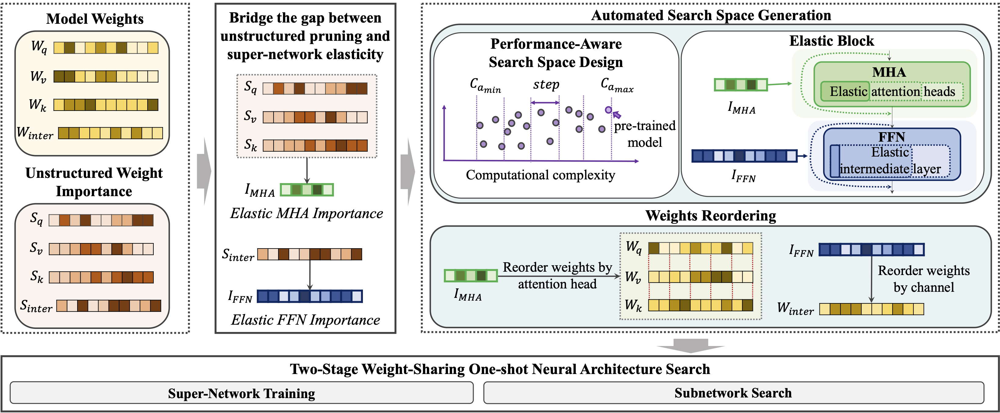

# EFTNAS
<p align="center">

</p>

Unstructured weight importance information is used to obtain
subnetwork configurations at the boundaries of the desired search space. Then, intermediate subnetworks
are identified depending on the required complexity for the search space, and all subnetwork configurations
are combined, effectively automating the search space generation based on the desired computation
complexity. Weights are then reordered, elasticity is enabled, and the super-network is trained. Finally,
high-performing Transformer-based subnetworks are discovered for a variety of performance targets.

## Env Setup

### 1. NNCF
```
git clone https://github.com/openvinotoolkit/nncf.git nncf_eftnas
cd nncf_eftnas
git checkout 415c3c4d
# Apply Patch 
git apply path/to/nncf.patch
pip install -e .
```

### 2. Hugging Face - Transformers
```
git clone https://github.com/huggingface/transformers.git
cd transformers
git checkout v4.29.1
git apply /path/to/transformers.patch
pip install -e .
pip install -r examples/pytorch/text-classification/requirements.txt
```

## EFTNAS Results

- BERT: {Subnet version}_{task}
    - Subnetwork version: S1 for EFTNAS-S1, S2 for EFTNAS-S2
    - task: datasets in GLUE benchmark, SQuADv1, SQuADv2
- ViT: ViT

## EFTNAS Configs
Configs are in the folder `eftnas_configs`.
- BERT: {Subnet version}_{task}.json
    - Subnetwork version: S1 for EFTNAS-S1, S2 for EFTNAS-S2
    - task: datasets in GLUE benchmark, SQuADv1, SQuADv2
- ViT: ViT.json

### Config Explanation (Extra parameters in the nncf config)
- **movement_sparsity_total_epochs**: Used for movement sparsity. This overwrites `num_train_epochs` in the following scripts. It is similar to `epoch_lr` in BootstrapNAS. The real training epochs depends on `warmup_end_epoch` in movement_sparsity params.
- **model_name_or_path**: Overwrite `model_name_or_path` in the following scripts.
- **kd_teacher_model**: Teacher model.
- **reorg_cache_model**: Cache model of trained importance weight.

## Reproduce Results

** In the following scripts, nncf_config.json will overwrite some hyper-parameters.
For example, `model_name_or_path` and `num_train_epochs`.

** Besides EFTNAS-S2 + BERT + GLUE benchmark, other fine-tuned supernets are from HuggingFace Hub.

### Search Space Generation

#### Step1. Train an importance weight
```
cd /path/to/nncf
./eftnas_search_space/generate_importance_weight.sh DEVICE TRANSFORMER_PATH /path/to/nncf/eftnas_configs/eftnas_search_space_demo.json OUT_DIR
```
- DEVICE: gpu device
- TRANSFORMER_PATH: path to transformers installed via [2-transformers](#2-transformers)
- OUT_DIR: output dir

#### Step2. Generate search space
```
cd /path/to/nncf
python eftnas_search_space/generate_eftnas_search_space.py --importance_weight_dir OUT_DIR --config_save_name SAVE_NAME
```
- OUT_DIR: output dir used in step1
- SAVE_NAME: name of the saved nncf config. This saved nncf config includes the search space generated by eftnas.

### Train BERT - GLUE

#### Train BERT - get finetuned supernet (EFTNAS-S2)
```
cd /path/to/transformers
CUDA_VISIBLE_DEVICES=${DEVICES}  python examples/pytorch/text-classification/run_glue.py \
    --model_name_or_path google/bert_uncased_L-8_H-512_A-8 \
    --task_name $TASK_NAME \
    --output_dir ${OUT_DIR} \
    --overwrite_output_dir \
    --do_train \
    --do_eval \
    --do_search \
    --max_seq_length 128 \
    --per_device_train_batch_size 32 \
    --per_device_eval_batch_size 32 \
    --learning_rate 2e-5 \
    --num_train_epochs ${TRAINED_EPOCHS} \
    --evaluation_strategy epoch \
    --save_strategy epoch \
    --save_total_limit 1 \
    --fp16 \
    --seed 42
```
- TASK_NAME: mnli, qqp, qnli, cola, rte, sst2, mrpc
- OUT_DIR: Your output dir
- TRAINED_EPOCHS:
    - 5: cola, mrpc, qnli, rte, sst2
    - 3: mnli, qqp

#### Train BERT - NAS part
```
cd /path/to/transformers
CUDA_VISIBLE_DEVICES=${DEVICES}  python examples/pytorch/text-classification/run_glue.py \
    --model_name_or_path bert-base-uncased \
    --task_name $TASK_NAME \
    --nncf_config ${CONFIG} \
    --output_dir ${OUT_DIR} \
    --overwrite_output_dir \
    --do_train \
    --do_eval \
    --do_search \
    --max_seq_length 128 \
    --per_device_train_batch_size 32 \
    --per_device_eval_batch_size 128 \
    --learning_rate 2e-5 \
    --num_train_epochs 5 \
    --evaluation_strategy epoch \
    --save_strategy epoch \
    --save_total_limit 1 \
    --seed 42 \
    --fp16
```
- TASK_NAME: mnli, qqp, qnli, cola, rte, sst2, mrpc
- CONFIG: Select one from `eftnas_configs`.
- OUT_DIR: Your output dir

### Train BERT - SQuADv1.1

```
cd /path/to/transformers
CUDA_VISIBLE_DEVICES=${DEVICES} python examples/pytorch/question-answering/run_qa.py \
    --model_name_or_path bert-base-uncased \
    --do_train \
    --do_eval \
    --do_search \
    --dataset_name squad \
    --learning_rate 3e-5 \
    --per_gpu_train_batch_size 16 \
    --per_gpu_eval_batch_size 128 \
    --output_dir ${OUT_DIR} \
    --max_seq_length 384 \
    --doc_stride 128 \
    --nncf_config ${CONFIG} \
    --evaluation_strategy epoch \
    --save_strategy epoch \
    --metric_for_best_model f1 \
    --overwrite_output_dir \
    --save_total_limit 1 \
    --num_train_epochs 8 \
    --fp16
```
- CONFIG: Select one from `eftnas_configs`.
- OUT_DIR: Your output dir

### Train BERT - SQuADv2.0

```
CUDA_VISIBLE_DEVICES=${DEVICES} python examples/pytorch/question-answering/run_qa.py \
    --model_name_or_path bert-base-uncased \
    --do_train \
    --do_eval \
    --do_search \
    --dataset_name squad_v2 \
    --learning_rate 3e-5 \
    --per_gpu_train_batch_size 16 \
    --per_gpu_eval_batch_size 128 \
    --version_2_with_negative \
    --output_dir ${OUT_DIR} \
    --max_seq_length 384 \
    --doc_stride 128 \
    --nncf_config ${CONFIG} \
    --evaluation_strategy epoch \
    --save_strategy epoch \
    --metric_for_best_model f1 \
    --kd_teacher_model deepset/bert-base-uncased-squad2 \
    --ddp_find_unused_parameters True \
    --overwrite_output_dir \
    --save_total_limit 1 \
    --num_train_epochs 8 \
    --fp16
```
- CONFIG: Select one from `eftnas_configs`.
- OUT_DIR: Your output dir

### Train ViT

#### Train ViT - importance mask

```
cd /path/to/nncf/examples/experimental/torch/classification/
CUDA_VISIBLE_DEVICES=${DEVICES} python get_importance_mask.py \
    --mode train \
    --config eftnas_configs/ViT.json \
    --data ${IMAGENET_DIR} \
    --log-dir ${OUT_DIR}
```

- IMAGENET_DIR: path to imagenet dataset. 
- OUT_DIR: Your output dir.

#### Train ViT - NAS part

```
cd /path/to/nncf/examples/experimental/torch/classification/
CUDA_VISIBLE_DEVICES=${DEVICES} torchrun --nproc_per_node=2 --master_port ${MASTER_PORT} bootstrap_nas.py \
    --mode train \
    --config eftnas_configs/ViT.json \
    --data ${IMAGENET_DIR} \
    --log-dir $OUT_DIR \
    --importance-mask-weight ${IMPORTANCE_MASK_WEIGHT}
```

- IMAGENET_DIR: path to imagenet dataset. 
- MASTER_PORT: master port
- OUT_DIR: Your output dir.
- IMPORTANCE_MASK_WEIGHT: ../eftnas_vit/model_best.pth)


# Citation

```
@inproceedings{
eftnas2024,
title={Searching for Efficient Language Models in First-Order Weight-Reordered Super-Networks},
author={J. Pablo Munoz and Yi Zheng and Nilesh Jain},
booktitle={The 2024 Joint International Conference on Computational Linguistics, Language Resources and Evaluation},
year={2024},
url={}
}
```

# Results on the GLUE Benchmark 


| Model                                 | GFLOPs    | GLUE Avg.     | MNLI-m   | QNLI | QQP      | SST-2    | CoLA     | MRPC     | RTE  |
|---------------------------------------|-----------|---------------|----------|------|----------|----------|----------|----------|------|
| **Development Set**                   |
| BERT<sub>base</sub> (teacher)         | 11.2      | 83.3          | 84.7     | 91.8 | 91.0     | 93.2     | 59.6     | 90.4     | 72.5 |
| DistilBERT<sub>6</sub>                | 5.7       | 78.6          | 82.2     | 89.2 | 88.5     | 91.3     | 51.3     | 87.5     | 59.9 |
| TinyBERT<sub>6</sub>                  | 5.7       | 81.9          | 84.5     | 91.1 | 91.1     | 93.0     | 54.0     | 90.6     | 73.4 |
| MiniLM                                | 5.7       | 81.0          | 84.0     | 91.0 | 91.0     | 92.0     | 49.2     | 88.4     | 71.5 |
| MiniLMv2 (6x768)                      | 5.7       | 81.7          | 84.2     | 90.8 | 91.1     | 92.4     | 52.5     | 88.9     | 72.1 |
| \rowcolor{lightgray} EFTNAS-S1 (Ours) | 5.7       | **82.9**      | **84.6** | 90.8 | **91.2** | **93.5** | **60.6** | **90.8** | 69.0 |
| NAS-BERT<sub>10</sub> + KD            | 2.3       | 74.2          | 76.4     | 86.3 | 88.5     | 88.6     | 34.0     | 79.1     | 66.6 |
| AutoDistil<sub>Proxy-S</sub>          | 2.0       | 79.9          | 83.2     | 90.0 | 90.6     | 90.1     | 48.3     | 88.3     | 69.4 |
| AutoDistil<sub>Agnostic</sub>         | 2.1       | 79.6          | 82.8     | 89.9 | 90.8     | 90.6     | 47.1     | 87.3     | 69.0 |
| **Test Set**                          |
| $\mathrm{BERT_{base}}$ (teacher)      | 11.2      | 78.2          | 84.6     | 90.5 | 71.2     | 93.5     | 52.1     | 88.9     | 66.4 |
| $\mathrm{DistilBERT_6}$               | 5.7       | 76.8          | 82.6     | 88.9 | 70.1     | 92.5     | 49.0     | 86.9     | 58.4 |
| $\mathrm{TinyBERT_6 \dagger}$         | 5.7       | 79.4          | 84.6     | 90.4 | 71.6     | 93.1     | 51.1     | 87.3     | 70.0 |
| $\mathrm{MiniLMv2} (6 \times 768)$    | 5.7       | 77.5          | 83.8     | 90.2 | 70.9     | 92.9     | 46.6     | 89.1     | 69.2 |
| \rowcolor{lightgray} EFTNAS-S1 (Ours) | 5.7       | 77.7          | 83.7     | 89.9 | **71.8** | **93.4** | **52.6** | 87.6     | 65.0 |
| \rowcolor{lightgray} EFNAS-S2 (Ours)  | 2.2       | 75.2          | 82.0     | 87.8 | 70.6     | 91.4     | 44.5     | 86.1     | 64.0 |
