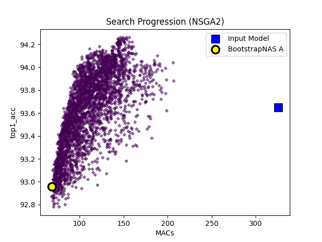

# ResNet50-CIFAR10

## 1. Current Results

| Architecture | MACs | Acc@1 | 
|-|-|-|
[Pretrained](train_results_others/pretrained.pt)        |  325.8M  |  93.65  |
[SuperNet](supernet_weights.pth)          |  325.8M  |  94.09  |
Minimum SubNet    |  64.1M   |  92.61  |
[Best Found SubNet](search_results_others/subnetwork_best.pth) |  68.3M   |  92.96  | 

## 2. Search Progression

